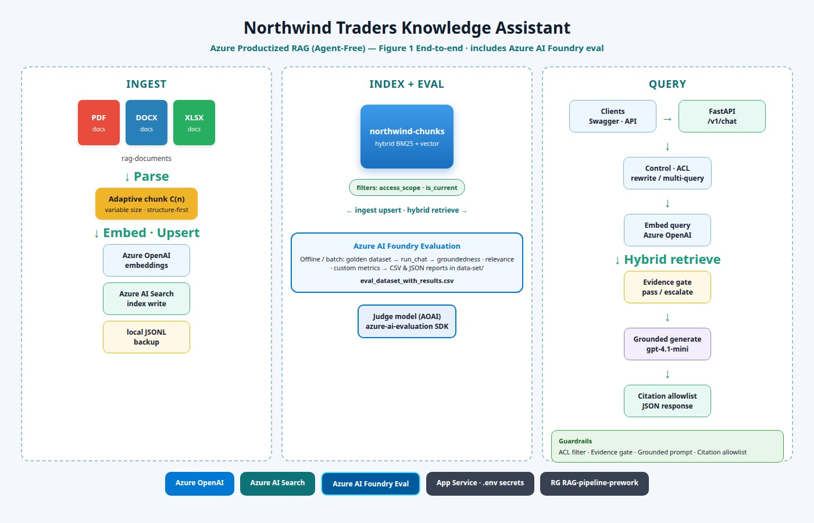
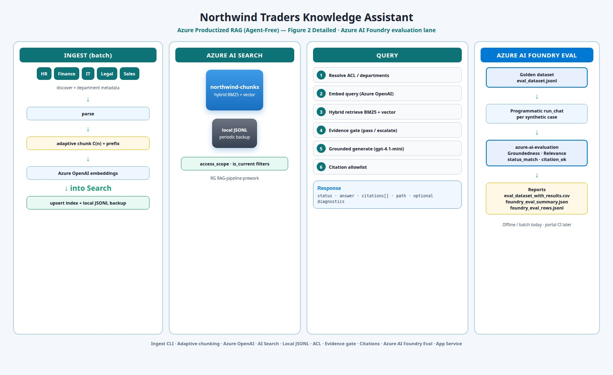
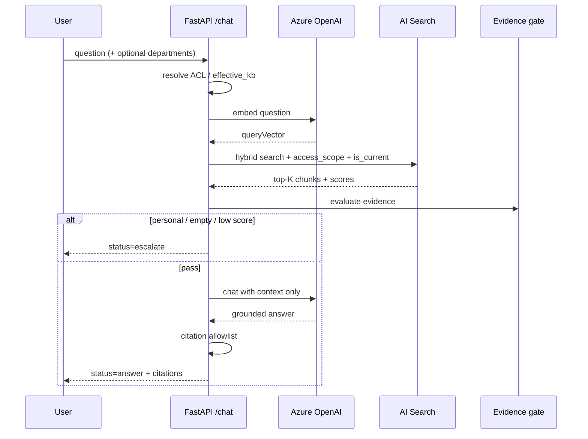
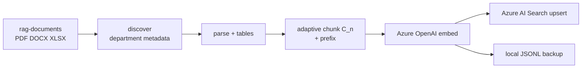
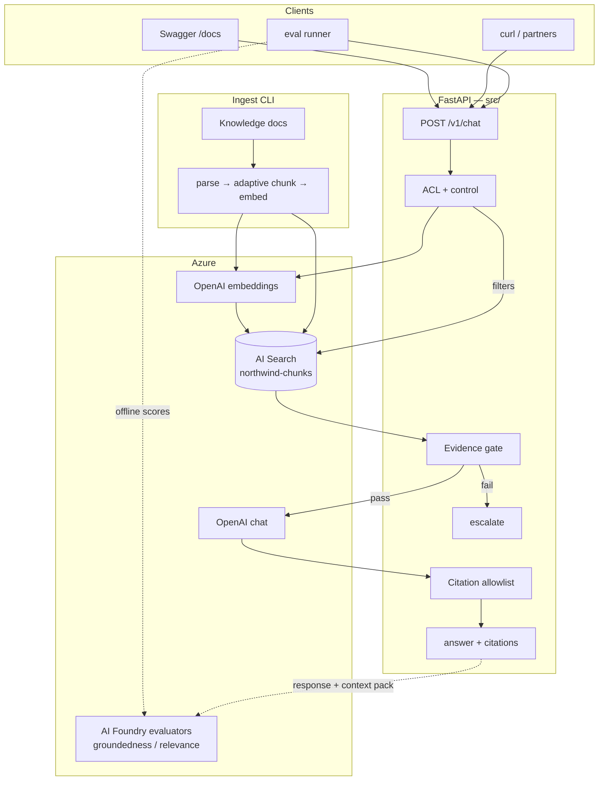
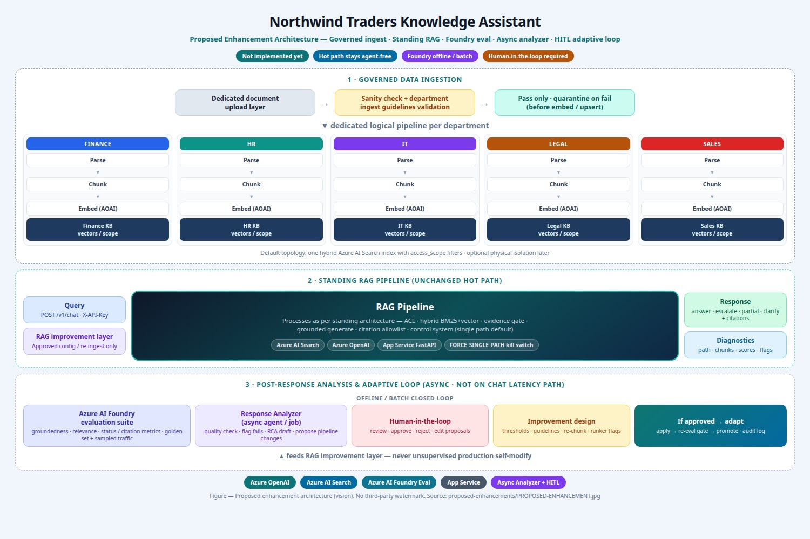

# Northwind Traders — Enterprise Knowledge Assistant

[](https://www.python.org/downloads/)
[](https://azure.microsoft.com/products/ai-services/openai-service)
[](https://azure.microsoft.com/products/ai-services/ai-search)
[](https://fastapi.tiangolo.com/)

---

## 1. Project description

**Northwind Traders Enterprise Knowledge Assistant** is an **agent-free, Azure-productized RAG** application over mock enterprise policy documents (**HR, Finance, IT, Legal, Sales**).

Users ask natural-language questions. The system **retrieves** grounded passages from **Azure AI Search**, applies an **evidence gate**, then answers with **Azure OpenAI** and **citations**. A **control system** opens multi-query / rewrite only when confident; otherwise it stays on a classic single-path pipeline:

> *smart when confident · classic when not · measurable always · killable instantly*

| | |
|--|--|
| **Application root** | This repository (standalone) |
| **API** | `POST /chat` · `POST /v1/chat` |
| **Public test URL** | **https://northwind-rag-azure.azurewebsites.net** |
| **Swagger (try questions)** | https://northwind-rag-azure.azurewebsites.net/docs |
| **Health** | https://northwind-rag-azure.azurewebsites.net/health |
| **Auth** | Header **`X-API-Key`** = `API_KEYS` from App Settings / local `.env` |

**Quick test:** open Swagger → **Authorize** with your `X-API-Key` → **POST /v1/chat**:

```json
{"question": "How many PTO days for 0-2 years of service?"}
```

(Free-tier App Service may take 10–30s after idle.) Knowledge corpus: sibling `../rag-documents/` (or `RAG_DOCUMENTS_PATH`).

---

## 2. Table of contents

1. [Project description](#1-project-description)
2. [Table of contents](#2-table-of-contents)
3. [Project features](#3-project-features)
4. [Architecture](#4-architecture)
5. [Monitoring & testing](#5-monitoring--testing)
6. [Question & answers (architecture & problem-solving)](#6-question--answers-architecture--problem-solving)
7. [What is planned](#7-what-is-planned)
   - [7.0 Proposed enhancement vision](#70-proposed-enhancement-vision)
   - [7.1 Governed, department-aware ingestion](#71-governed-department-aware-ingestion)
   - [7.2 Continuous analysis & Response Analyzer (async)](#72-continuous-analysis--response-analyzer-async)
   - [7.3 Human-in-the-loop adaptive improvement](#73-human-in-the-loop-adaptive-improvement)
   - [7.4 Near-term product features](#74-near-term-product-features)
   - [7.5 Cost optimization (planned)](#75-cost-optimization-planned)
   - [7.6 Delivery phases](#76-delivery-phases)
8. [Reproduce the project](#8-reproduce-the-project)

---

## 3. Project features

### Multi-format ingest

- Ingests **PDF, DOCX, and XLSX** from Northwind department packs.
- Discovers department / `access_scope`, filename, and section metadata during parse.
- Writes **Azure AI Search** plus a **local JSONL** backup for offline / local mode.

### Adaptive chunking (structure-first) — detail

- **Structure before length:** prefer heading, table, and sheet boundaries so rules stay intact.
- **Length scale:** \(C(n)=\mathrm{clamp}(n/\alpha,\,C_{\min},\,C_{\max})\) with defaults \(C_{\min}=128\), \(C_{\max}=512\), \(\alpha=3\); higher cap for atomic tables.
- **Overlap** \(\beta\) preserves boundary sentences; each chunk is **prefixed** (Northwind · dept · doc · section · current) for hybrid retrieval.

### Hybrid retrieval

- **BM25 + vector** against index `northwind-chunks`.
- Hard filters: **`access_scope` (ACL)** and default **`is_current`** (currency).
- Optional **lexical rerank** after fetching a larger candidate set (`RAG_RETRIEVE_K` → `RAG_CONTEXT_K`).

### Control system (conditional strategies)

- Default **classic single path:** embed → hybrid → evidence gate → generate → cite.
- **Multi-query (A)** only for high-confidence compare/vs + entity pairs (not bare “and”).
- **Query rewrite (C)** when clients send `history[]`; search never embeds full chat transcripts.
- **Kill switch:** `FORCE_SINGLE_PATH=true` or request `rag_mode: "single"`.

### Grounded generation & citations

- Azure OpenAI answers **only from retrieved context** (temperature 0).
- **Citation allowlist** restricts `chunk_id`s to the retrieved set.
- Offline **extractive** answers if chat is unavailable.

### Guardrails & response statuses

- Evidence gate: weak / empty / personal → **`escalate`** (no invention).
- Multi-facet gaps → **`partial`**; high-precision underspec → **`clarify`**.
- Demo ACL via `departments`; production should map **Entra** groups server-side.

### API sharing & OpenAPI

- Interactive **Swagger** at `/docs`; probes at `/health`.
- Share with partners: App Service URL + **`X-API-Key`**; optional **APIM**.

### Evaluation hooks

- Synthetic golden set + runner produce a **results CSV**.
- **Azure AI Evaluation / Foundry** metrics: groundedness, relevance, custom status/citation checks (see §5).

---

## 4. Architecture

### 4.1 Diagrams



*Figure 1 — End-to-end: ingest, Azure AI Search index, query path, and **Azure AI Foundry** evaluation lane (no third-party watermark).*



*Figure 2 — Detailed ingest · Search · query steps · **Azure AI Foundry eval** reports.*

### 4.2 System overview (runtime + Azure AI Foundry)

```text
                         NORTHWIND KNOWLEDGE ASSISTANT
                      Azure Productized RAG (Agent-Free)

  Clients: Swagger / curl / partners / eval runner
                    │  POST /v1/chat  (+ X-API-Key)
                    ▼
  ┌────────────────────────────────────────────────────────────┐
  │  FastAPI thin policy (src/)                                  │
  │  Control · ACL · rewrite(C) · temporal(B) · multi(A)         │
  │  Evidence gate · grounded generate · citation allowlist      │
  └───────────┬──────────────────────────────┬─────────────────┘
              │ filters + query vector         │ context pack
              ▼                                ▼
  ┌───────────────────────┐      ┌──────────────────────────┐
  │  Azure AI Search      │      │  Azure OpenAI            │
  │  northwind-chunks     │      │  embed + chat            │
  │  hybrid + ACL filters │      │  (e.g. gpt-4.1-mini)     │
  └───────────▲───────────┘      └──────────────────────────┘
              │ ingest
  ┌───────────┴───────────────────────────────────────────────┐
  │  INGEST: rag-documents → parse → adaptive chunk → embed    │
  └───────────────────────────────────────────────────────────┘

  ┌───────────────────────────────────────────────────────────┐
  │  Azure AI Foundry evaluation (offline / batch)              │
  │  data-set/*.jsonl → run_chat per row →                     │
  │  azure-ai-evaluation (groundedness, relevance, custom)     │
  │  → eval_dataset_with_results.csv + foundry_eval_*.json     │
  │  Optional: log runs to a Foundry project portal            │
  └───────────────────────────────────────────────────────────┘
```

### 4.3 Query pipeline (control system)

| Pillar | Behavior |
|--------|----------|
| Smart when confident | Multi-query / rewrite / temporal only above confidence thresholds |
| Classic when not | Default **single path** |
| Measurable always | Diagnostics: path, rewrite, sub_queries, latency |
| Killable instantly | `FORCE_SINGLE_PATH` / `rag_mode=single` |

```text
POST /v1/chat
  → CONTROL (flags / kill switch)
  → C rewrite? (history + conf)
  → B temporal filters (is_current default)
  → A multi-query? (compare + conf) else single_path
  → evidence gate → generate → citation allowlist
  → answer | partial | escalate | clarify | access_denied
```

| Path | Meaning |
|------|---------|
| `single` | Classic hybrid (default) |
| `multi` | Compare multi-query used |
| `single_fallback` | Multi attempted, then classic |

### 4.4 Query sequence



### 4.5 Ingestion pipeline

Batch path used to build/refresh the knowledge index. Entry point: `python scripts/ingest.py` → `src/ingestion/pipeline.py` (`run_ingest`).

```text
rag-documents/
  → discover_documents()     # walk PDF/DOCX/XLSX, infer department
  → parse_file()             # extract text + section splits + tables
  → chunk_document()         # adaptive C(n), overlap, prefixes
  → embed_chunks()           # Azure OpenAI embeddings (or local hash fallback)
  → upsert_chunks()          # Azure AI Search upload + local JSONL rewrite
```

| Stage | Module | What it does |
|-------|--------|----------------|
| **Discover** | `src/ingestion/discover.py` | Recursively finds `.pdf` / `.docx` / `.xlsx`. Infers **department** from path (e.g. `.../HR/...` → HR). Builds `SourceFile` records. |
| **Parse** | `src/ingestion/parse.py` | PDF via `pypdf`; DOCX via `python-docx` (paragraphs + tables); XLSX via `openpyxl` (one section per sheet). Splits body on heading heuristics (`1.`, `2.1`, Title Case lines). Derives `is_current`, optional year/version from filename/text (e.g. Pricing2026 vs 2025). |
| **Chunk** | `src/ingestion/chunk.py` | **Structure-first** (section/table units), then length windows. Target size \(C(n)=\mathrm{clamp}(n/\alpha, C_{\min}, C_{\max})\) (defaults α=3, 128–512 tokens; higher cap for atomic tables). Overlap \(o=\mathrm{clamp}(\beta C, 32, 96)\). Token counting prefers `tiktoken` (`cl100k_base`). Each chunk gets stable `id`, `doc_id`, `section`, `department` / `access_scope` / `knowledge_base_id`, `chunk_kind`, and a **content prefix** for retrieval. |
| **Embed** | `src/ingestion/embed.py` | Batched `embeddings.create` on Azure OpenAI **embed deployment** (default dim **1536** for `text-embedding-3-small`). If Azure is not configured, deterministic **local hash vectors** keep the pipeline offline-demoable. |
| **Index** | `src/ingestion/index.py` | Always rewrites `data/local_index.jsonl` (full replace for deterministic re-ingest). When Azure Search is configured and not `--force-local`, ensures index schema then **upload_documents** in batches of 50. |

**CLI**

```bash
python scripts/ingest.py              # Azure + local when .env is set
python scripts/ingest.py --force-local  # JSONL only
```

**Outputs:** ~100+ chunks from the Northwind pack; summary logs files OK/failed and counts by department.



### 4.6 Retrieval pipeline

Online path used by every chat request (after control-system rewrite / multi-query planning). Core: `src/retrieval/search.py` (`retrieve` → Azure or local), then optional rerank / multi-query merge in `src/services/chat.py`.

```text
question (or rewritten / sub-query)
  → resolve departments (ACL allow-list)
  → embed query (same embed deployment as ingest)
  → hybrid search + OData filters
  → optional lexical rerank (RAG_RETRIEVE_K → RAG_CONTEXT_K)
  → pack context → evidence gate → generate → citation allowlist
```

| Stage | Detail |
|-------|--------|
| **ACL** | Request `departments` (or default all KBs) normalized to `HR|Finance|IT|Legal|Sales`. Empty/invalid → `access_denied`. |
| **Query text** | Raw user question, or Strategy **C** standalone rewrite, or Strategy **A** facet sub-queries. |
| **Azure retrieve** | `search_text` + `VectorizedQuery` on `contentVector` (`k` nearest) + OData `filter`. Returns score + chunk metadata. |
| **Local retrieve** | Load JSONL; filter by scope/`is_current`; score = blend of cosine(local/Azure vectors) + keyword overlap. |
| **Rerank** | `RERANK_MODE=lexical`: boost hits whose section/filename/body share query tokens; keep top `RAG_CONTEXT_K`. |
| **Multi-query** | Parallel `retrieve` per facet → membership accept → **quota merge** (min per facet) → optional `single_fallback` if multi underperforms. |
| **Pack** | `pack_context_blocks`: flat or facet-sectioned text with `chunk_id`, file, section, scores. |
| **Gate** | Empty hits, score &lt; τ, or personal-data pattern → `escalate` (no invent). |
| **Generate** | Chat completion with system “answer only from context”; extractive fallback if no AOAI. |
| **Cite** | Allowlist: only retrieved `chunk_id`s. |

**Key settings:** `RAG_TOP_K`, `RAG_RETRIEVE_K`, `RAG_CONTEXT_K`, `RAG_MIN_SCORE` / `RAG_MIN_SCORE_AZURE` (Azure hybrid RRF scores are typically ~0.01–0.05), control flags for multi/rewrite.

### 4.7 Azure AI Search integration

| Concern | Implementation |
|---------|----------------|
| **Clients** | `SearchIndexClient` (schema) + `SearchClient` (upload/search) via API key in `src/azure_clients.py`. |
| **Index name** | `AZURE_SEARCH_INDEX` (default `northwind-chunks`). |
| **Create-if-missing** | `ensure_search_index()` builds hybrid schema once. |
| **Vector config** | HNSW algorithm + profile `vs-profile`; `contentVector` dim matches embed model (1536). |
| **Text field** | `content` searchable with `en.lucene` analyzer. |
| **Filterable metadata** | `access_scope`, `is_current`, `department`, `knowledge_base_id`, `doc_id`, `filename`, `section`, `version`, `chunk_kind`, `effective_date`, `token_count`. |
| **Ingest write** | Map `ChunkRecord` → search doc (`content` + `contentVector` + metadata); batch `upload_documents`. |
| **Query** | Hybrid: keyword `search_text` **and** vector query on `contentVector`. |
| **Security filter (example)** | `(access_scope eq 'HR' or …) and is_current eq true` unless `include_historical=true`. |
| **Fallback** | On Search failure or missing config, retrieval falls back to **local JSONL** with a warning log. |

**Index field sketch**

| Field | Role |
|-------|------|
| `id` | Key (chunk id) |
| `content` | Full-text / BM25 |
| `contentVector` | ANN / hybrid vector |
| `access_scope`, `is_current` | ACL + currency filters |
| `filename`, `section`, `doc_id` | Citations & diagnostics |
| `department`, `knowledge_base_id` | Facets / ACL alignment |

### 4.8 Azure OpenAI integration

| Concern | Implementation |
|---------|----------------|
| **Client** | Official `openai.AzureOpenAI` with `azure_endpoint`, `api_key`, `api_version` (`src/azure_clients.py`). |
| **Embeddings (ingest + query)** | Deployment `AZURE_OPENAI_EMBED_DEPLOYMENT` (e.g. `text-embedding-3-small`). Same model for corpus and query vectors so hybrid search stays consistent. Batched in ingest; single (or few) query vectors at chat time / multi-query. |
| **Chat (generation)** | Deployment `AZURE_OPENAI_CHAT_DEPLOYMENT` (e.g. `gpt-4.1-mini`). System prompt: answer **only** from packed context; cite `chunk_id=…`; do not invent. `temperature=0`, capped `max_tokens`. |
| **Eval judges (Foundry)** | Same AOAI account can power `GroundednessEvaluator` / `RelevanceEvaluator` via `azure-ai-evaluation` (optional separate `AZURE_OPENAI_EVAL_DEPLOYMENT`). |
| **Connectivity probe** | `scripts/smoke_azure.py` / `probe_connectivity()`: tiny embed + list indexes. |
| **Mode resolution** | `effective_mode`: `azure` if both OpenAI + Search configured; `azure-openai-only` if only OpenAI; else `local` (hash embed + JSONL + extractive answers). |
| **Failure behavior** | Embed/chat errors → log + extractive or local fallback where applicable; does not leak keys to clients. |

**Config (typical)**

```bash
AZURE_OPENAI_ENDPOINT=https://<resource>.openai.azure.com/
AZURE_OPENAI_API_KEY=...
AZURE_OPENAI_API_VERSION=2024-10-21
AZURE_OPENAI_CHAT_DEPLOYMENT=gpt-4.1-mini
AZURE_OPENAI_EMBED_DEPLOYMENT=text-embedding-3-small
```

**Secrets stay on the server** (App Settings / `.env`). Partners only receive the app URL + `X-API-Key` (or APIM key).

### 4.9 End-to-end flowchart (with Foundry eval lane)



### 4.10 Component map

| Layer | Implementation |
|-------|----------------|
| API | `src/api/app.py` |
| Orchestration / control | `src/services/chat.py` |
| Ingest | `src/ingestion/*` + `scripts/ingest.py` |
| Retrieval | `search.py`, `multi_query.py`, `temporal.py`, `rerank.py` |
| Azure clients | `src/azure_clients.py` (OpenAI + Search index/search clients, `ensure_search_index`) |
| Conversation | `src/conversation/rewrite.py` |
| Generation | `src/generation/answer.py`, `pack.py` |
| Guardrails | `evidence.py`, `citations.py`, `ambiguity.py` |
| Foundry eval | `scripts/run_eval_dataset.py`, `run_foundry_eval.py`, `src/eval/` |
| Config | `src/config.py` + `.env` |

**Not in the live path:** multi-agent Heimdall/Smith runtime — productized thin pipeline only.

### 4.11 Share surface

```text
Partners → (optional APIM) → App Service FastAPI → OpenAI + AI Search (private)
```

Public host: **https://northwind-rag-azure.azurewebsites.net**

---

## 5. Monitoring & testing

### 5.1 Quality layers

| Layer | Purpose | Command |
|-------|---------|---------|
| Connectivity | OpenAI + Search | `python scripts/smoke_azure.py` |
| Smoke Q&A | Core facts | `python scripts/smoke_query.py` |
| Control bar | Path hygiene | `python scripts/run_regression.py --suite all` |
| Golden dataset | ~40 synthetic cases | `python scripts/run_eval_dataset.py` |
| Foundry judges | Groundedness / relevance | same (or `run_foundry_eval.py`) |

Portal/CI continuous Foundry eval is planned (offline SDK scoring is live).

> **Future:** a closed quality loop (Foundry suite → async Response Analyzer → human approval → gated pipeline updates) is described under [§7.0–7.3](#70-proposed-enhancement-vision). Not implemented in the current ship path.

### 5.2 Synthetic data

Under **[data-set/](data-set/)** (golden set + results reports):

| File | Role |
|------|------|
| [eval_dataset.jsonl](data-set/eval_dataset.jsonl) | Golden questions (primary) |
| [eval_dataset.csv](data-set/eval_dataset.csv) | Spreadsheet view (no app results) |

**Categories:** straightforward · multi-document · ambiguous · no_answer · follow_up · version_conflict — across HR / IT / Finance / Legal / Sales (~40 cases). Fields include `expected_answer`, `expected_document` / `section`, `expected_status`, optional `history` for multi-turn.

### 5.3 Programmatic querying of the RAG app

```text
eval_dataset.jsonl
       │  for each case
       ▼
  in-process run_chat(...)  OR  HTTP POST /v1/chat
       │
       ├── status, response, citation, path, latency
       ▼
  eval_dataset_with_results.csv
  eval_results.jsonl
       │
       ▼
  Azure AI Evaluation SDK (Foundry-compatible)
  groundedness · relevance · status_match · citation_ok · …
       │
       ▼
  foundry_eval_summary.json
  foundry_eval_rows.jsonl
  foundry_sdk_*.json
```

```bash
# from repository root
source .venv/bin/activate && export PYTHONPATH=$(pwd)

# App answers + Foundry scores → CSV
python scripts/run_eval_dataset.py

# Code metrics only (no judge model cost)
python scripts/run_eval_dataset.py --no-foundry

# Against public URL
python scripts/run_eval_dataset.py --mode http \
  --base-url https://northwind-rag-azure.azurewebsites.net \
  --api-key "$API_KEYS"
```

### 5.4 Results report (open these)

| Report | Path |
|--------|------|
| **Primary results CSV** | **[data-set/eval_dataset_with_results.csv](data-set/eval_dataset_with_results.csv)** |
| Raw app payloads | [data-set/eval_results.jsonl](data-set/eval_results.jsonl) |
| Foundry aggregate | [data-set/foundry_eval_summary.json](data-set/foundry_eval_summary.json) |
| Foundry per-row | [data-set/foundry_eval_rows.jsonl](data-set/foundry_eval_rows.jsonl) |

**CSV includes:** golden fields + `status` / **`response`** / **`citation`** / `path` / `latency_ms` + Foundry columns (`status_match`, `citation_ok`, `gold_token_recall`, `groundedness`, `relevance`, `foundry_scored`).

**Latest snapshot (illustrative):** ~40 cases; status_match ≈ 0.93; citation_ok = 1.0; mean groundedness ≈ 4.6/5; mean relevance ≈ 4.5/5.

### 5.5 Runtime diagnostics

Request `"include_diagnostics": true` on `/v1/chat` for path, rewrite, sub_queries, and `latency_ms`. Health shows control flags when deployed (`phase: control-system`).

---

## 6. Question & answers (architecture & problem-solving)

Full design-review methodology for retrieval quality, latency, scale, security, cost, and wrong-answer-with-citation.

#

---

### How we debug RAG (shared mental model)

Every production issue maps onto a **stage**, and we never jump to “swap the model” first.

```text
User Query
  → Intent / rewrite / filters
  → Embedding (if used)
  → Retrieval (candidate generation)
  → Ranking / rerank / diversity
  → Context pack (what the LLM sees)
  → Prompt + model
  → Generation
  → Citation allowlist / post-checks
  → Response to user
```

For each stage we ask: **What entered? What left? Was it correct? How long? How much $?**

Instrument so every request has a **`query_id`** with: rewritten query, filters, top‑K chunk ids + scores, selected pack, token counts, latency breakdown, model name, citation ids.

---

### 1. Retrieval quality

#### Problem

> The chatbot retrieves 5 chunks, but only one is relevant.

#### Debugging methodology

**Goal:** Separate *bad candidate generation* from *bad ranking* from *bad chunking/index content*.

| Step | Action | What you’re proving |
|------|--------|---------------------|
| 1 | Reproduce with fixed `query_id`; log all 5 hits (id, score, filename, section, snippet) | Issue is real and inspectable |
| 2 | Label each hit: **relevant / partial / irrelevant** (human or offline judge) | Quantify “1 of 5” |
| 3 | Read the **one good chunk** and the query: does gold content exist elsewhere in the index? | Corpus coverage vs retrieval failure |
| 4 | Compare **BM25-only vs vector-only vs hybrid** for the same query | Which signal is polluting top‑K |
| 5 | Inspect **chunk text** of false positives: boilerplate, headers, repeated policy intros | Chunking / duplication issues |
| 6 | Check **filters** (`is_current`, department, ACL): over-filter (miss gold) or under-filter (wrong KB) | Policy bugs vs ranking |
| 7 | Check **query form**: vague, multi-intent, follow-up not rewritten | Query understanding |
| 8 | Compute offline metrics on an eval set: **Recall@K, nDCG, MRR**, % queries with ≥1 relevant in top‑K | Trend, not anecdote |

**Decision tree**

```text
Is the relevant passage in the index at all?
  NO  → fix ingest/chunking/OCR/sectioning (content gap)
  YES → Does it appear below rank 5?
          YES → ranking/rerank/diversity problem (retrieve more, rerank harder)
          NO  → not retrieved at all → embedding mismatch, bad query, wrong filter,
                or chunk too small/noisy to match
```

#### Improvements (layered)

| Layer | Change |
|-------|--------|
| **Query** | Rewrite to standalone noun phrases; multi-query for compare intents; spell/expand acronyms |
| **Retrieve more, rank better** | Raise `top_k` to 20–50 → **cross-encoder / semantic ranker** → keep 3–5 |
| **Hybrid** | Tune BM25 vs vector fusion; field boosting on `title` / `section` / `filename` |
| **Filters & metadata** | Department, `doc_family`, `is_current`, section type; avoid pure embedding for ACL |
| **Diversity** | MMR or per-`doc_id` caps so 4 near-duplicates don’t crowd the one good hit |
| **Chunking** | Structure-first sections; less boilerplate; parent–child (retrieve small, expand parent) |
| **Negative evidence** | Evidence gate: if top score or relevance gap is weak → escalate, don’t answer from junk |
| **Eval loop** | Add this query to `data-set/`; fail CI if Recall@5 regresses |

#### What “good” looks like

Not “all 5 perfect,” but: **≥1 highly relevant in top ranks**, low **context pollution**, and the generator **ignores or never sees** low-value noise (or refuses when evidence is weak).

---

### 2. Latency

#### Problem

> Production response time increases from **3 seconds to 12 seconds**.

#### Debugging methodology

**Goal:** Find **which stage** regressed (p50 vs p95 vs p99), not guess.

##### 1. Split the path with timers

Instrument every hop (already partially in diagnostics):

| Span | Typical owners |
|------|----------------|
| Auth / gateway (APIM) | Network, policy, cold start |
| Query rewrite / classification | Extra LLM call |
| Embed query | Azure OpenAI embeddings |
| Search (hybrid) | AI Search capacity, filters, `$top` |
| Rerank | Second model or large candidate set |
| Multi-query fan-out | N parallel searches + merge |
| Context pack | Serialization, parent expand |
| Chat completion | Model, tokens in/out, TPM throttling |
| Post (citations, safety) | Usually small |

##### 2. Compare distributions, not one request

- **p50 / p95 / p99** before vs after  
- **By route:** single-path vs multi-query vs conversational rewrite  
- **By dependency:** Azure OpenAI 429/503, Search latency, ACA cold starts  
- **Correlation:** deploy time, index size growth, traffic spike, new feature flags  

##### 3. Symptom → likely cause

| Observation | Likely bottleneck |
|-------------|-------------------|
| Embed + search still ~same; **LLM span ×3–4** | Larger context, slower model, retries, capacity |
| **Search** alone 100ms → 3s+ | Index scale, under-provisioned replicas, heavy filters, huge `$top` |
| **First request after idle** slow | Container cold start / scale-to-zero |
| Spiky latency + 429 in logs | **Throttling** + client retries |
| Only multi-turn or compare slow | Rewrite + multi-query fan-out |
| All spans OK server-side; client sees 12s | Gateway timeout/retry, client network |

##### 4. Reproduce under control

- Replay same `query_id` payload in staging with identical index snapshot  
- Disable multi-query / rewrite flags to A/B path cost  
- Measure token counts: `prompt_tokens` growth often explains LLM latency  

#### Mitigations (once bottleneck known)

| Bottleneck | Mitigations |
|------------|-------------|
| LLM | Smaller/faster model for easy queries; cap context tokens; stop multi-hop when single path enough |
| Search | Right-size replicas/partitions; narrower filters; cache frequent queries; avoid unbounded `$top` |
| Embeddings | Batch where possible; cache embedding(query) for hot questions |
| Fan-out | Parallel I/O; limit sub-queries to 2; short-circuit on strong single hit |
| Cold start | Min replicas ≥1 for demo/prod; provisioned concurrency |
| Throttling | Quotas, backoff, queue, reserved capacity |

**Rule:** Fix the stage that owns the **delta** (9s), not the stage that was always 200ms.

---

### 3. Scale

#### Problem

> System grows from **10,000 documents → 5 million documents**.

#### What changes (and what must not)

At 10k, a single hybrid index + one app replica can work.  
At 5M **documents** (often **tens of millions of chunks**), you redesign for **partitioning, metadata discipline, retrieval fan-in control, and ops**.

#### Architectural changes to consider

##### A. Index & retrieval topology

| Change | Why |
|--------|-----|
| **Partition by domain / tenant / department** (or filterable security-trimmed indexes) | Smaller search space; safer ACL; independent scale |
| Right-size **Azure AI Search** partitions & replicas | Storage + QPS + latency SLOs |
| **Hierarchical retrieval** | Cheap first-stage (BM25 / sparse / ANN) → rerank top N only |
| **Doc store vs vector store** | Vectors for recall; object storage / SQL for full section text |
| **Sharding strategy** | By `knowledge_base_id`, geography, or time if multi-tenant |

##### B. Ingest pipeline

| Change | Why |
|--------|-----|
| **Event-driven ingest** (blob → queue → workers) | 5M docs never reprocess in one batch job |
| Incremental / change-feed updates | Avoid full re-embed |
| **Idempotent upserts**, versioned chunk schema | Safe reindex |
| Dead-letter + poison document quarantine | One bad PDF can’t block the fleet |
| Embedding **throughput management** (batch, backoff) | Cost and rate limits |

##### C. Query path

| Change | Why |
|--------|-----|
| **Mandatory metadata filters** before global ANN | Don’t search 5M docs for every HR leave question |
| Query router: department / intent → subset of indexes | Latency + precision |
| Multi-query only when detected | Cost multiplies with scale |
| Result **caching** (query hash + ACL key) | Hot FAQ load |
| Async patterns for heavy jobs | Keep interactive path &lt; few seconds |

##### D. Quality at scale

| Change | Why |
|--------|-----|
| Continuous **eval sampling** + golden sets per domain | Regressions hide in 5M |
| Chunk quality SLAs (empty, OCR fail, language) | Garbage volume grows with corpus |
| Dedup / near-dup detection | Near-copies destroy ranking |

##### E. Platform

| Change | Why |
|--------|-----|
| Horizontal scale of API (ACA/AKS) + autoscale on QPS/latency | App tier |
| Separate **read** (query) and **write** (ingest) workloads | No ingest storm → query SLO breach |
| Observability: per-index latency, recall proxies, cost per 1k queries | Operate the system |

#### What we deliberately keep

- Hybrid retrieval + grounded generation + **fail-closed** evidence gates  
- **ACL on every retrieve** (scale does not excuse “search everything then filter in the LLM”)  
- Citations bound to retrieved ids  

#### Rough evolution path

```text
10k docs   → single index, hybrid, simple filters, adaptive chunking
100k–1M    → partitions/replicas, ingest queue, rerank, cache, stronger metadata
5M docs    → multi-index or hard partitions, hierarchical retrieve,
             dedicated ingest fleet, domain routers, SLO/cost budgets
```

---

### 4. Security

#### Problem

> HR, Finance, Legal, Engineering use the same chatbot.  
> **HR documents must never be retrieved for Engineering users.**

#### Principle

**Access control is enforced at retrieval time (and again at citation time), not only in the prompt.**  
The model must never see unauthorized chunks. Prompt instructions (“don’t use HR”) are **not** a control.

#### Reference architecture (access-controlled RAG)

```text
                    ┌─────────────────────┐
  User ──SSO───────►│ Identity (Entra ID) │
                    │ groups / app roles  │
                    └──────────┬──────────┘
                               │ token: allowed_kb[] / groups
                               ▼
                    ┌─────────────────────┐
                    │ API gateway (APIM)  │
                    │ authN + optional   │
                    │ JWT validation     │
                    └──────────┬──────────┘
                               ▼
                    ┌─────────────────────┐
                    │ RAG API             │
                    │ effective_kb =      │
                    │  map(groups) ∩      │
                    │  requested scope    │
                    └──────────┬──────────┘
                               │
               filter: access_scope in effective_kb
               (and never trust client-only departments in prod)
                               ▼
                    ┌─────────────────────┐
                    │ AI Search / index   │
                    │ every chunk has     │
                    │ knowledge_base_id / │
                    │ access_scope        │
                    └──────────┬──────────┘
                               ▼
                    Context pack ⊆ filtered hits only
                    Citations ⊆ retrieved allowlist
                    Audit log: user, effective_kb, chunk_ids
```

#### Concrete controls

| Control | Implementation |
|---------|----------------|
| **Identity** | Microsoft Entra ID; users in groups e.g. `kb.hr`, `kb.finance`, `kb.legal`, `kb.engineering` |
| **Authorization mapping** | Group → `knowledge_base_id` / `access_scope` server-side |
| **Index metadata** | Every chunk carries `knowledge_base_id`, `access_scope`, optionally sensitivity |
| **Hard filter on search** | `access_scope eq 'Engineering' OR ...` only for scopes in `effective_kb` |
| **No client-trusted ACL in prod** | Ignore or only *intersect* client `departments` with token claims |
| **Empty effective_kb** | `403 access_denied` — do not search unfiltered |
| **Citation firewall** | Drop any citation whose chunk wasn’t in filtered retrieval |
| **Separate indexes (optional high assurance)** | HR index credentials only on HR-capable deployments |
| **Audit** | Log user id, groups, filters, chunk ids; alert on cross-scope anomalies |
| **Ingest isolation** | Pipeline tags docs by source path/department; mis-tag = security bug |
| **Row-level / document-level ACL** | Beyond department: sensitivity labels, “HR-managers-only” |

#### Failure modes to test

| Test | Expected |
|------|----------|
| Engineering user asks parental leave policy | No HR chunks in retrieval; escalate/insufficient or public FAQ only if allowed |
| Engineering user forges `departments: ["HR"]` | Still no HR (server ignores/intersects) |
| User in HR+Finance | Only those KBs |
| Citation smuggling | Impossible if allowlist enforced |

#### Demo vs production (this repo)

| Mode | Behavior |
|------|----------|
| **Demo / local** | Request body `departments` simulates ACL |
| **Production** | Entra groups → `effective_kb`; APIM + app enforce; never sole trust of body |

---

### 5. Cost

#### Problem

> Azure OpenAI costs suddenly increase significantly.

#### Debugging methodology

**Goal:** Attribute $ to **which token sink** and **which traffic pattern**.

##### 1. Break down the bill

| Meter | Pipeline stage |
|-------|----------------|
| Chat **input** tokens | Prompt = system + context pack + history |
| Chat **output** tokens | Long answers, retries, verbose style |
| **Embedding** tokens | Query embed + **ingest re-embed** of corpus |
| Deployments / PTU vs PAYG | Capacity model |
| Other | Search, bandwidth (usually secondary to AOAI) |

Pull: Azure Cost Management by resource + **Azure OpenAI metrics** (tokens, requests) + app logs (`query_id`, model, `prompt_tokens`, `completion_tokens`, path=single|multi).

##### 2. Hypotheses ranked by real-world frequency

1. **Context pack too large** (top_k↑, multi-query merge, parent expand, full history in prompt)  
2. **Traffic spike** or bot/loop hitting `/chat`  
3. **Multi-query / rewrite** enabled → 2–3× embeds + searches + larger packs  
4. **Model upgrade** (e.g. to a costlier GPT) for all traffic  
5. **Ingest storm** re-embedding millions of chunks  
6. **Retries** on 429/timeouts (client doubles spend)  
7. **No cache** for identical FAQ queries  
8. Eval/smoke scripts left running against production deployments  

##### 3. Correlate

```text
cost_per_day vs requests_per_day vs avg_prompt_tokens vs avg_completion_tokens
  vs multi_query_rate vs ingest_jobs vs model_name
```

If **cost/request** jumped with stable QPS → tokens per request or model price.  
If **QPS** jumped with stable tokens/request → traffic or abuse.

#### Optimization playbook

| Lever | Actions |
|-------|---------|
| **Tokens (prompt)** | Hard **context token budget**; pack only top reranked; strip boilerplate; don’t dump full chat history into the model |
| **Tokens (completion)** | Max tokens cap; concise system style; avoid “explain everything” defaults |
| **Retrieval context** | Smaller top_k after rerank; diversify to reduce redundant paragraphs; hierarchical expand only when needed |
| **Model selection** | Router: **small/fast model** for extractive FAQs; larger model only for compare/reasoning; never use flagship for rewrite-only |
| **Caching** | Cache **(acl_key, normalized_query) → answer** for hot FAQs; cache **query embeddings**; HTTP cache where safe |
| **Embeddings** | Don’t re-embed unchanged chunks; batch ingest; pin model; avoid embedding entire conversation |
| **Repeated queries** | Semantic or exact cache; bot rate limits; idempotency for clients |
| **Multi-path control** | Feature-flag multi-query; run only when intent detector fires |
| **Ops** | Budgets + alerts on tokens/day; separate dev/prod deployments; kill runaway eval jobs |

#### Cost guardrails (engineering)

- Log **tokens in/out per request** and alert on p95 prompt tokens.  
- Default path: single retrieve + small pack.  
- Evidence gate: **don’t call chat** when retrieval is empty/weak (saves $ and hallucinations).

---

### 6. Production failure

#### Problem

> Users report: *“The chatbot gives correct answers most of the time, but **occasionally** gives a completely wrong answer with a **valid-looking citation**.”*

This is one of the **most dangerous** RAG failures: the citation looks authoritative, so users trust a wrong claim.  
We care about **debugging methodology** along the full chain.

#### Core insight

A “valid-looking citation” usually means:

- The **chunk_id exists** and was retrieved (allowlist passed), **but**  
- The **claim is not actually supported** by that chunk, **or**  
- The chunk is **related but wrong version/entity/section**, **or**  
- Ranking put a **plausible distractor** next to a weak true hit and the LLM over-generalized.

So we debug **grounding**, not only “was there a citation.”

#### Stage-by-stage methodology

Use a reported example: save **user query, full answer, citation ids, timestamp, user ACL**. Replay with the same index version if possible.

##### Stage 1 — User query

| Check | Questions |
|-------|-----------|
| Ambiguity | Underspecified entity/year/dept? |
| Follow-up | Missing rewrite (“What about Standard?”) attached to wrong prior entity? |
| Adversarial / odd phrasing | Typos that shift BM25? |

**Artifacts:** raw question, rewritten `retrieval_query`, turn class, temporal intent.

##### Stage 2 — Retrieval

| Check | Questions |
|-------|-----------|
| Candidate set | Were **correct** chunks retrieved at all? |
| Distractors | Did wrong-version / wrong-plan / wrong-dept chunks enter top‑K? |
| Filters | Did `is_current` / ACL fail open or mis-tag docs? |
| Scores | Is the cited chunk a **low-score** hitchhiker? |

**Artifacts:** full hit list with scores, filters applied, index generation.

**Outcomes:**

- Gold missing → chunking/index/query issue (classic retrieval).  
- Gold present but buried → ranking.  
- Only distractors with high scores → metadata/version/entity confusion.

##### Stage 3 — Ranking / selection

| Check | Questions |
|-------|-----------|
| Why this chunk ranked high | Lexical overlap on shared words (“policy”, “employee”) without entity match? |
| Diversity | Five near-duplicates from wrong doc crowding out the right one? |
| Multi-query merge | Wrong facet bucket accepted without membership check? |

**Fix direction:** rerank, facet membership, version collapse, MMR.

##### Stage 4 — Context pack

| Check | Questions |
|-------|-----------|
| What the model **literally saw** | Log final packed context for the `query_id` |
| Truncation | Was the supporting sentence cut off? |
| Pollution | Wrong chunk adjacent to right chunk encouraging blend? |
| Ordering | Did instruction say “prefer earlier passages” and wrong one was first? |

**Critical:** If the wrong fact is **in the pack**, the model is often “correctly” reading a bad pack.  
If the wrong fact is **not** in the pack, the model **hallucinated** despite citations (or cited a chunk that doesn’t contain the claim).

##### Stage 5 — Prompt

| Check | Questions |
|-------|-----------|
| Grounding rules | “Answer only from context”; “say insufficient if not present”? |
| Citation instructions | Model told to cite even when unsure? → encourages decorative citations |
| History | Prior assistant message treated as evidence? |

Tighten: **no answer without support**; **cite only spans that entail the claim**; refuse on conflict.

##### Stage 6 — LLM

| Check | Questions |
|-------|-----------|
| Non-determinism | Same pack → same error? Temperature &gt; 0? |
| Model change | Deployment swap? |
| Overconfidence | Fuses two numbers from different sections? |
| Instruction following | Ignores “if not in context”? |

Mitigate: lower temperature for factual RAG; smaller extractive models for table lookup; optional **NLI / groundedness** check (claim vs cited chunk).

##### Stage 7 — Citation

| Check | Questions |
|-------|-----------|
| Allowlist only? | Citation ∈ retrieved set (should already hold) |
| **Support check** | Does cited chunk **entail** the sentence? (human or automated) |
| Wrong binding | Model cites chunk A for a fact only in chunk B |
| Version cosmetics | Cites `LeavePolicy.pdf` but answer used 2024 semantics from another hit |

**Upgrade citation quality:**

1. Allowlist chunk ids (baseline).  
2. **Span-level** or section-level quotes.  
3. Post-hoc **attribution**: for each sentence, require overlap / entailment with cited chunk or strip/regenerate.  
4. Show **filename + section + version/date** in UI so users can spot stale policy.

#### Occasional failures — why “most of the time” works

| Pattern | Why intermittent |
|---------|------------------|
| Ambiguous queries | Sometimes rewrite lucky, sometimes not |
| Near-duplicate versions | 2025 vs 2026 both in index; filter off or soft |
| Multi-intent | Fan-out merges unevenly |
| Borderline scores | Evidence gate threshold flapping |
| Entity twins | Enterprise vs Enterprise Plus; Standard not in corpus |
| Temperature / rare sampling | Low but non-zero bad completions |

#### Systematic response (beyond one bugfix)

1. **Logging pack + hits for every production answer** (privacy-reviewed retention).  
2. **User “report wrong answer”** → stores full chain.  
3. **Groundedness scorer** sample 1–5% of traffic or all high-risk domains (HR/Legal).  
4. **Eval set** cases for known confusions (version, entity switch).  
5. **Fail closed** on low support rather than pretty wrong answers.  
6. Incident review: treat “wrong + citation” as **Sev-1 trust** issue, not cosmetic NLP error.

#### One-page debug checklist

```text
[ ] Capture query_id, raw + rewritten query, ACL, answer, citations
[ ] Dump retrieval hits + scores; mark gold vs distractor
[ ] Dump exact context pack sent to the LLM
[ ] Does pack contain the wrong fact? → fix retrieve/rank/pack/version
[ ] Pack lacks wrong fact but answer has it? → prompt/LLM hallucination; tighten gate
[ ] Does cited chunk entail the claim? → if no, citation is decorative; add support check
[ ] Add regression case to data-set/; verify fix on replay
```

---

### Summary table 

| Topic | First move | Primary fix direction |
|-------|------------|------------------------|
| **1 Retrieval noise** | Label top‑K; BM25 vs vector; is gold in index? | Rerank, hybrid tune, chunking, diversity, evidence gate |
| **2 Latency 3s→12s** | Per-span timings; p95; tokens; 429s | Fix the span that owns the delta |
| **3 10k→5M docs** | Partitions, ingest fleet, mandatory filters | Hierarchical retrieve + ops + metadata |
| **4 Dept ACL** | Enforce filter from **identity**, not prompt | Chunk metadata + search filter + citation allowlist |
| **5 Cost spike** | Tokens/request vs QPS; model; ingest | Cap context, cache, model router, no chat if no evidence |
| **6 Wrong + citation** | Replay pack vs claim vs chunk entailment | Groundedness; version/entity; fail closed |

---

### Alignment with this codebase

| Practice | Where it shows up |
|----------|-------------------|
| Hybrid retrieve + filters | `src/retrieval/`, Azure AI Search |
| Evidence gate / escalate | `src/guardrails/evidence.py` |
| Citation allowlist | `src/guardrails/citations.py` |
| Department ACL (demo) | `departments` on `ChatRequest` → `access_scope` |
| Diagnostics / query path | `ChatResponse.diagnostics`, control flags |
| Eval questions | `data-set/eval_dataset.jsonl` + `scripts/run_eval_dataset.py` |
| Multi-doc / version / conversation strategies | Control system A/B/C in `src/` |

---

## 7. What is planned

This section covers **proposed enhancements** (closed-loop quality system) and **near-term product roadmap** items that are **not implemented** in the current ship path. The standing architecture in §4 remains the runtime core: **agent-free on the hot path**, measurable offline, killable instantly.

**Source artifacts (vision):**

| Artifact | Path |
|----------|------|
| Enhancement flowchart (source block diagram) | [`proposed-enhancements/PROPOSED-ENHANCEMENT.jpg`](proposed-enhancements/PROPOSED-ENHANCEMENT.jpg) |
| Enhancement brief | [`proposed-enhancements/PROPOSED-ENHANCMENT.pdf`](proposed-enhancements/PROPOSED-ENHANCMENT.pdf) |
| Architecture figure (this README) | [`docs/images/architecture-proposed-enhancement.jpg`](docs/images/architecture-proposed-enhancement.jpg) |

---

### 7.0 Proposed enhancement vision

**Goal:** wrap the existing Northwind RAG with a **governed ingest front door** and an **async quality loop** so bad answers are measured, root-caused, and fixed only after human approval — without turning chat into a multi-agent system.



*Figure 3 — Proposed enhancement architecture (vision, **not implemented**): governed multi-dept ingest → standing agent-free RAG → Azure AI Foundry evaluation → async Response Analyzer → human-in-the-loop → gated adaptive applies. No third-party watermark.*

```text
Dedicated document upload
        │
        ▼
Sanity check + ingest guidelines (per department)
        │
        ├── Finance ──► parse → chunk → embed → Finance KB
        ├── HR ───────► parse → chunk → embed → HR KB
        ├── IT ───────► parse → chunk → embed → IT KB
        ├── Legal ────► parse → chunk → embed → Legal KB
        └── Sales ────► parse → chunk → embed → Sales KB
        │
        ▼
   RAG pipeline  ◄──── RAG improvement layer (approved changes only)
   (standing architecture: ACL · hybrid · evidence gate · generate · cite)
        │
        ▼
     Response
        │
        ▼
Azure AI Foundry evaluation suite
        │
        ▼
Response Analyzer (async) → Human-in-the-loop → (if approved) improvement layer
```

| Stage | Intent |
|-------|--------|
| **Data ingestion** | Preset guidelines; dedicated **logical** pipeline per department; ingest only after sanity + guideline checks |
| **RAG pipeline** | Unchanged standing architecture (this repo’s productized path) |
| **Post-response analysis** | Azure AI Foundry full analysis suite on answers (and later, sampled traffic) |
| **Response Analyzer + HITL** | Score quality, flag failures, RCA, propose pipeline/config changes; **human approves**; then apply adaptively |

**Design principles (non-negotiable for this product):**

| Principle | Meaning |
|-----------|---------|
| **Hot path stays agent-free** | `POST /v1/chat` does not call a multi-step “improvement agent.” Analysis is **offline / async**. |
| **Foundry is the sensor** | Groundedness, relevance, status/citation metrics feed the loop. |
| **Analyzer is the interpreter** | Maps failures to retrieval / ranking / threshold / prompt / content-gap (see §6). |
| **Human is the actuator** | No unsupervised rewrite of production prompts, thresholds, or index schema. |
| **Adaptive = gated** | Approve → apply config or re-ingest → **re-run golden set** → promote (or roll back). |
| **Default topology** | Keep **one hybrid Azure AI Search index + `access_scope` filters** unless scale/isolation metrics require separate indexes. “Dedicated pipelines” start as **profiles, queues, and guidelines per department**. |

---

### 7.1 Governed, department-aware ingestion

**What the enhancement proposes**

- Preset **guidelines** for what may enter each department knowledge base  
- **Dedicated ingestion path** per department (Finance, HR, IT, Legal, Sales)  
- **Sanity check + guideline check** before data enters the RAG pipeline  
- Only then: parse → chunk → embed → store (as in Figure 3)

**What you have now**

| Capability | Status |
|------------|--------|
| Multi-format parse (PDF / DOCX / XLSX) | Implemented |
| Structure-first adaptive chunking | Implemented |
| Department / `access_scope` metadata + ACL filters | Implemented |
| Single hybrid index `northwind-chunks` + local JSONL | Implemented |
| Formal per-dept ingest guidelines document | **Not implemented** |
| Pre-ingest validation gate + quarantine queue | **Not implemented** |
| Separate physical vector DB per department | **Not implemented** (not required day one) |

**Proposed implementation shape**

| Piece | Plan |
|-------|------|
| **Guideline packs** | Versioned rules per dept (allowed file types, required metadata, PII patterns, max size, section expectations) — e.g. `docs/ingest-guidelines/{HR,Finance,IT,Legal,Sales}.yaml` |
| **Sanity gate** | Reject or quarantine: empty parse, corrupt file, missing dept scope, guideline violations — **before** embed/upsert |
| **Logical dedicated pipelines** | Same codepath, **dept profile** (chunk caps, ACL defaults, synonym lists, owners). Parallel workers optional under load. |
| **Physical isolation (optional later)** | Separate Search indexes or storage only if tenancy, blast-radius, or scale metrics demand it |
| **Upload layer** | Controlled intake (API or operator job) that always runs the gate — not ad-hoc folder drops without checks |

**Why this matters**

Garbage in → confident wrong answers out. A guideline gate turns “we have mock PDFs” into “only policy-grade content reaches the index,” and gives the Response Analyzer a clear **content-gap vs bad-chunk** story when eval fails.

---

### 7.2 Continuous analysis & Response Analyzer (async)

**What the enhancement proposes**

- **Azure Foundry–based full analysis suite** after responses  
- **Response Analyzer** that:  
  - obtains the response and Foundry metrics  
  - checks response quality  
  - **flags** incorrect responses for human review  
  - performs **RCA** and states root cause for humans  
  - **designs** suggested improvements to the existing RAG pipeline  

**What you have now**

| Capability | Status |
|------------|--------|
| Offline synthetic golden set (`data-set/eval_dataset.jsonl`) | Implemented |
| Programmatic run against live/local API | Implemented (`scripts/run_eval_dataset.py`) |
| Azure AI Evaluation: groundedness, relevance, status_match, citation_ok | Implemented (offline SDK → CSV/JSON) |
| Per-request `diagnostics` on chat responses | Implemented |
| Continuous Foundry project portal / PR gates / traffic sampling | **Not implemented** |
| Automated fail queue + RCA agent | **Not implemented** |

**Proposed loop (async only)**

```text
Chat response (+ diagnostics)
        │
        ▼
Azure AI Foundry evaluation  ──► scores & pass/fail
        │
        ▼
Response Analyzer (batch job)
  · join question, answer, chunks, scores
  · classify failure (retrieval / ranking / threshold / prompt / citation / content gap)
  · open review item with RCA draft + suggested change
        │
        ▼
Human review  ──► §7.3
```

| Analyzer output (proposed) | Example |
|----------------------------|---------|
| **Fail class** | `status_mismatch`, `weak_grounding`, `off_corpus_answered`, `wrong_chunk`, `content_gap` |
| **RCA draft** | “Hybrid top hit is expense policy; evidence score above threshold; personal-data gate did not fire — off-corpus trivia.” |
| **Suggested change** | Raise escalate floor · add deny-list pattern · re-chunk LeavePolicy §2.1 · enable semantic ranker · guideline fix for Sales price sheets |
| **Evidence pack** | `query_id`, filters, top chunk ids, Foundry scores, packed context hash |

**Relation to §6**

§6 documents **how humans debug** retrieval, latency, scale, security, cost, and production failures. The Response Analyzer is the **productized, batch form** of that methodology, with Foundry metrics as sensors — not a replacement for engineering judgment.

**Explicit non-goal**

Do **not** run the analyzer on the critical path of every `POST /v1/chat` (latency, cost, cascading failure). Sample production traffic and/or run on golden-set + flagged sessions only.

---

### 7.3 Human-in-the-loop adaptive improvement

**What the enhancement proposes**

- Human reviews suggested changes  
- If **approved**, the RAG pipeline becomes **adaptive** with those changes (Figure 3: *Human-in-the-loop → improvement design → if approved → adapt*)

**What you have now**

| Capability | Status |
|------------|--------|
| Manual config / code changes + re-eval | Operator process only |
| Kill switches (`FORCE_SINGLE_PATH`, feature flags) | Implemented |
| Automated approval queue → promote | **Not implemented** |
| Auto self-modify production without review | **Out of scope forever** |

**Proposed HITL flow**

| Step | Action |
|------|--------|
| 1 | Reviewer opens flagged item (question, answer, chunks, scores, RCA, proposal) |
| 2 | **Approve** / **reject** / **edit** proposal |
| 3 | On approve: apply **config** (thresholds, flags) and/or **re-ingest** affected docs |
| 4 | **Regression gate:** re-run synthetic suite (and smoke chats); block promote on metric regression |
| 5 | Promote to the environment that serves chat; keep audit log of who approved what |
| 6 | Kill switch: disable adaptive applies instantly if quality drops |

**What “adaptive” means here**

| Adaptive (in scope) | Not adaptive (out of scope) |
|---------------------|-----------------------------|
| Thresholds, control flags, synonym lists | Unsupervised prompt rewrites every hour |
| Re-chunk / re-embed after approved doc or guideline change | Model fine-tune without eval gate |
| Optional enable of semantic ranker after RCA + A/B | Agent that changes ACL rules without security review |

---

### 7.4 Near-term product features

These remain on the roadmap and are **orthogonal or complementary** to the closed-loop vision above.

#### Version offer catalog (Strategy B2)

| | |
|--|--|
| **What it is** | After answering from the **current** policy, attach **metadata** about older versions (e.g. “Leave Policy 2024 also exists”) and suggested actions: **answer previous** / **compare** / **dismiss** — **without** putting old document text in the LLM context until the user opts in. |
| **What Strategy B wants** | `alternate_versions[]` + `suggested_actions[]` from a **family catalog** (`doc_family_id` → current + previous versions). |
| **What you have now** | `is_current` filter (default current only); light temporal intent (year / “previous”); response field `version_used` from the top hit; **`alternate_versions` always returns `[]`**. Flag `ENABLE_VERSION_OFFER` exists but logic that **fills** offers is **not** built. |
| **Why not done** | Corpus is mostly **single-version** mock PDFs; no reliable `doc_family` / supersession graph. Enabling offers without real multi-year pairs would show **fake** “previous versions.” |
| **To finish later** | Ingest family + supersession metadata → store a small catalog → on current answers, look up predecessors → set `ENABLE_VERSION_OFFER=true`. |
| **Link to enhancement** | Ingest guidelines (§7.1) should require version / family metadata when multi-year packs exist. |

#### Semantic ranker / LLM evidence check

| | |
|--|--|
| **What it is** | (1) **Semantic ranker** on hybrid hits. (2) Optional **LLM sufficiency** check before answering. |
| **What you have now** | `RERANK_MODE=lexical`; score + personal-data gate. |
| **To finish later** | `RERANK_MODE=semantic` when SKU allows; optional `EVIDENCE_LLM_CHECK`. |
| **Link to enhancement** | Analyzer RCA may **recommend** enabling these after repeated wrong-chunk failures. |

#### Server-side conversation store

| | |
|--|--|
| **What it is** | Server-side slots / history by `conversation_id` (memory → Redis). |
| **What you have now** | Client-supplied `history[]` only. |
| **To finish later** | Session store with TTL and ACL isolation. |

#### Full Foundry portal / CI continuous eval

| | |
|--|--|
| **What it is** | Foundry **project UI** run history, PR gates, nightly suite, optional traffic sampling. |
| **What you have now** | Offline SDK scoring into `data-set/` CSV + JSON reports. |
| **To finish later** | Foundry project portal logging, PR/CI gates, nightly suite, traffic sampling — **foundation for §7.2**. |

#### Entra / Content Safety / Key Vault

| | |
|--|--|
| **What it is** | Production identity ACL, content safety on I/O, secrets in Key Vault. |
| **What you have now** | Demo `departments` headers + app settings / API keys. |
| **Link to enhancement** | Ingest guidelines should align with Content Safety / PII rules; ACL at retrieval should move to **Entra groups**. |

---

### 7.5 Cost optimization (planned)

| Lever | Plan |
|-------|------|
| Context budget | Hard token cap; pack only post-rerank top‑K |
| Model router | Small model for FAQs; larger only for compare/reasoning |
| Caching | Cache answers and query embeddings for hot FAQs |
| Conditional multi-path | Keep multi-query/rewrite confidence-gated (started) |
| No chat without evidence | Extend gate; expensive judges only when needed |
| Eval cost | Cheap judge deployment; `--no-foundry` in PR; rate-limit-aware batching |
| **Analyzer loop cost** | Sample production traffic (e.g. 1–5%); code metrics first; LLM RCA **only on failures** |
| Ops | Token budgets/alerts; separate dev/prod deployments |

See also cost methodology in §6.

---

### 7.6 Delivery phases

| Phase | Scope | Outcome | Status |
|-------|--------|---------|--------|
| **P0** | Document vision in README; link `proposed-enhancements/` + Figure 3 | Shared backlog language | **This section** |
| **P1** | Ingest guidelines + sanity/quarantine gate | Governed intake before embed | Planned |
| **P2** | Nightly/CI Foundry + golden-set gates | Continuous measurable quality | Planned |
| **P3** | Fail queue: `query_id` + diagnostics + scores | Humans can review production-like fails | Planned |
| **P4** | Async Response Analyzer (classify + RCA draft + proposal) | Faster triage | Planned |
| **P5** | HITL approve → apply → re-eval → promote | Controlled adaptation | Planned |
| **P6** | Dept scale-out (workers / optional separate indexes) only if metrics require | Scale without redesigning ACL story | Optional |

**Dependency sketch**

```text
P1 governed ingest ──┐
                     ├──► P2 continuous Foundry ──► P3 review queue ──► P4 analyzer ──► P5 HITL adaptive
§7.4 product features (version offer, Entra, ranker, sessions) in parallel where independent
```

---

### Summary: proposed enhancement vs current product

| Layer | Today | Proposed enhancement |
|-------|--------|----------------------|
| Ingest | Adaptive chunk + single index | Guidelines + sanity gate + per-dept logical pipelines |
| Query RAG | Standing agent-free pipeline | **Unchanged** core |
| Eval | Offline Foundry + CSV | Continuous suite + sampling |
| Learning loop | Manual debug (§6) | Analyzer RCA + HITL + gated adaptive applies |
| Agents on chat path | None | **Still none** — analyzer is async only |

---

## 8. Reproduce the project

### Step 0 — Prerequisites

| Tool | Check |
|------|--------|
| Git | `git --version` |
| Python 3.11+ | `python3 --version` |
| Azure subscription | OpenAI + AI Search for full cloud path |
| Azure CLI (optional) | `az login` for provisioning |

---

### Step 1 — Clone

```bash
git clone https://github.com/<YOUR_ORG>/<THIS_REPO>.git
cd <THIS_REPO>
```

Or if you already have the files locally:

```bash
cd /path/to/<THIS_REPO>
```

---

### Step 2 — Knowledge documents

Ensure Northwind policy files are available (PDF / DOCX / XLSX packs for HR, Finance, IT, Legal, Sales):

| Layout | Path |
|--------|------|
| Default | `./rag-documents/` (set `RAG_DOCUMENTS_PATH=./rag-documents` in `.env` if needed) |
| Custom | Any directory via `RAG_DOCUMENTS_PATH` |

Copy or clone your corpus into `rag-documents/` before ingest. The repository does not ship proprietary policy binaries by default.

---

### Step 3 — Virtual environment and dependencies

**Linux / macOS**

```bash
python3 -m venv .venv
source .venv/bin/activate
pip install --upgrade pip
pip install -r requirements.txt
export PYTHONPATH=$(pwd)
```

**Windows (PowerShell)**

```powershell
python -m venv .venv
.\.venv\Scripts\Activate.ps1
pip install --upgrade pip
pip install -r requirements.txt
$env:PYTHONPATH = (Get-Location).Path
```

Verify import:

```bash
python -c "from src.api.app import app; print(app.title)"
```

---

### Step 4 — Configure `.env`

```bash
cp .env.example .env
# edit .env with your secrets — never commit .env
```

**Full Azure mode (recommended):**

```bash
APP_MODE=azure
LOG_LEVEL=WARNING
AZURE_LOG_LEVEL=WARNING

AZURE_OPENAI_ENDPOINT=https://<resource>.openai.azure.com/
AZURE_OPENAI_API_KEY=<key>
AZURE_OPENAI_API_VERSION=2024-10-21
AZURE_OPENAI_CHAT_DEPLOYMENT=<chat-deployment>       
AZURE_OPENAI_EMBED_DEPLOYMENT=<embed-deployment>     

AZURE_SEARCH_ENDPOINT=https://<search>.search.windows.net
AZURE_SEARCH_API_KEY=<key>
AZURE_SEARCH_INDEX=northwind-chunks

RAG_DOCUMENTS_PATH=../rag-documents
```

**Connectivity probe:**

```bash
python scripts/smoke_azure.py
# expect openai_ok: true, search_ok: true, effective_mode: azure
```

**Offline-only (no Azure):**

```bash
APP_MODE=local
# leave Azure keys empty
```

---

### Step 5 — Ingest

```bash
export PYTHONPATH=$(pwd)

# Azure embeddings + AI Search + local JSONL
python scripts/ingest.py

# OR offline
python scripts/ingest.py --force-local
```

Success looks like:

```text
OK: 11 files → 100+ chunks → data/local_index.jsonl
```

---

### Step 6 — Automated tests

```bash
export PYTHONPATH=$(pwd)
export LOG_LEVEL=WARNING
export AZURE_LOG_LEVEL=WARNING

python scripts/smoke_query.py
# expect: 5/5 passed
```

Optional HTTP demo:

```bash
bash scripts/demo_smoke.sh
```

---

### Step 7 — Run the API

```bash
export PYTHONPATH=$(pwd)
export LOG_LEVEL=WARNING
export AZURE_LOG_LEVEL=WARNING

uvicorn src.api.app:app --host 127.0.0.1 --port 8000
```

| URL | Purpose |
|-----|---------|
| http://127.0.0.1:8000/docs | Swagger UI |
| http://127.0.0.1:8000/health | Health + mode + endpoints (public) |
| http://127.0.0.1:8000/chat | RAG endpoint |
| http://127.0.0.1:8000/v1/chat | Versioned alias (preferred for partners) |

**Confirm the right app (must list `/chat`):**

```bash
curl -s http://127.0.0.1:8000/health | python3 -m json.tool
```

Look for `"phase": "control-system"` (or share-api on older deploys), `"endpoints"` with `"/chat"` / `"/v1/chat"`, and optional `"control"` flags.

---

### Step 8 — Manual chat

```bash
curl -s http://127.0.0.1:8000/chat \
  -H "Content-Type: application/json" \
  -d '{"question":"How many PTO days for 0-2 years of service?"}' \
  | python3 -m json.tool
```

Expected: `"status":"answer"`, **15** PTO days, citations present.

In Swagger: **POST /chat** → Try it out → **one** JSON object only → Execute (wait 5–15s on Azure).

---

### Reproduction checklist

| # | Action | Success |
|---|--------|---------|
| 1 | Clone / open this folder | App tree present |
| 2 | venv + pip install | `from src.api.app import app` works |
| 3 | `.env` set | `smoke_azure.py` OK or `APP_MODE=local` |
| 4 | `ingest.py` | 11 files, 100+ chunks |
| 5 | `smoke_query.py` | 5/5 passed |
| 6 | `uvicorn src.api.app:app` | health shows `/chat`, phase `control-system` |
| 7 | POST /chat or /v1/chat | Grounded answer + citations |
| 8 | `python scripts/run_regression.py --suite all` | Single + enhanced bars green |

### Troubleshooting

| Symptom | Fix |
|---------|-----|
| `{"detail":"Not Found"}` on `/chat` | Wrong process on :8000 — kill it; start from **this** folder with `src.api.app:app` |
| Swagger only shows old P0 routes | Restart uvicorn; hard-refresh `/docs` |
| No response in Swagger | Wait longer; fix invalid JSON (`\` must be `\\`); one object per request |
| `effective_mode: local` with keys | Ensure `.env` is in **this** directory; variable names match `.env.example` |

---

### Configuration essentials

```bash
cp .env.example .env
# set AZURE_OPENAI_*, AZURE_SEARCH_*, API_KEYS, RAG_DOCUMENTS_PATH
```

Control flags (see `.env.example`): `FORCE_SINGLE_PATH`, `ENABLE_MULTI_QUERY`, `ENABLE_QUERY_REWRITE`, `ENABLE_VERSION_OFFER` (offer logic not filled yet), etc.

### Day-to-day

```bash
# from repository root
source .venv/bin/activate && export PYTHONPATH=$(pwd)
python scripts/smoke_query.py
python scripts/run_regression.py --suite all
python scripts/run_eval_dataset.py --no-foundry   # or full Foundry scoring
uvicorn src.api.app:app --host 127.0.0.1 --port 8000
# http://127.0.0.1:8000/docs
# public: https://northwind-rag-azure.azurewebsites.net/docs
```

### Security (short)

- Never commit `.env` or keys.
- Share only public URL + `X-API-Key` (or APIM key) — never OpenAI/Search admin keys.
- Demo ACL uses request `departments`; production should use Entra groups server-side.
